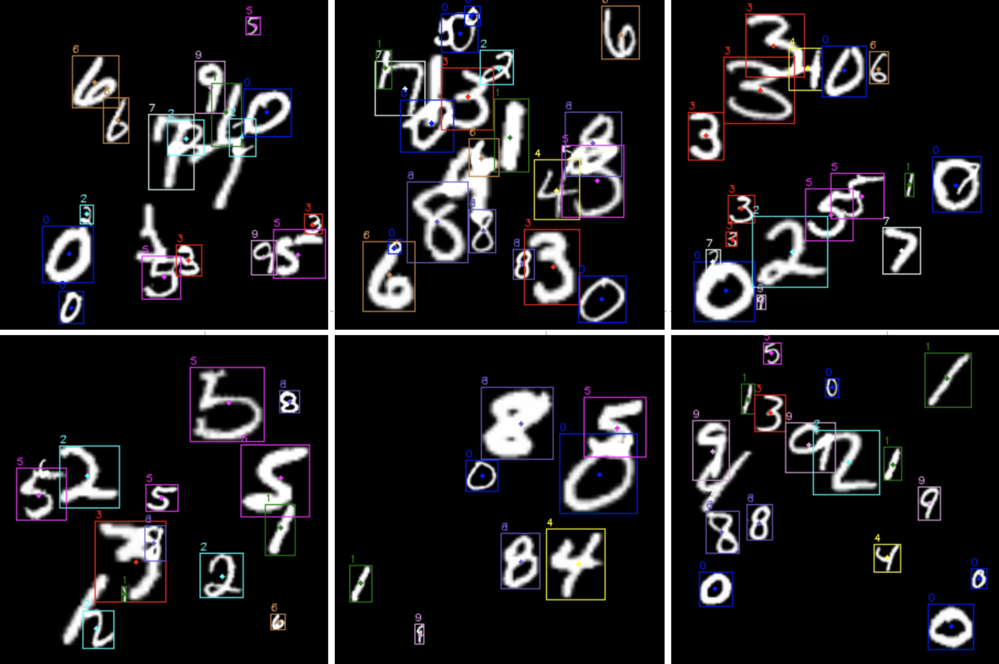

# DNN-centerNet



## Introduction

This project is a re-implementation of CenterNet in PyTorch for detecting digits in the Mnist Detection dataset. To complete this project, we relied on the paper ["CenterNet: Keypoint Triplets for Object Detection"](https://arxiv.org/pdf/1904.08189.pdf) as well as the following GitHubs: https://github.com/Duankaiwen/CenterNet and https://github.com/zzzxxxttt/pytorch_simple_CenterNet_47.

## Prerequisites

### Corner Pooling Layers

Before running this project, you must first compile the Corner Pooling Layers. Follow these steps:

Access the cpools_ folder: 
```bash
cd <DNN-centerNet dir>/src/center_net/cpools_/
```

If you want to use a CPU version, run the following command: 
```bash
python setup_cpu.py install --user
```

If you want to use a GPU version, run the following command: 
```bash
python setup_gpu.py install --user
```

### Dataset

The dataset used for this project is the Mnist Detection dataset. It can be downloaded using this project: https://github.com/hukkelas/MNIST-ObjectDetection

For this project we used the following command to generate the dataset:
```bash
 python generate_data.py --max-digits-per-image 15 --imsize 300
```

## Usage

This project is divided into two parts: the backbone and the CenterNet (which uses the backbone). The backbone is a small CNN trained with Mnist data. It allows CenterNet to have a first representation of what a digit is.

All models are saved in the folder: *models*.

### Backbone
A model of the backbone is already trained and available, however you can retrain it using the following command:
    
```bash
python train_backbone.py [-h] [--name NAME]
```

- *--name* option allows you to specify the filename to save the model. Default is *backbone_model.pth*.

### CenterNet

Similarly, a trained CenterNet model is also available, however you can retrain it using the following command: 

```bash
python train_center_net.py [-h] [--name NAME] [--epochs EPOCHS] [--dataset DATASET] [--batch_size BATCH_SIZE]
```

- *--name* option allows you to specify the filename to save the model. Default is *center_net_model.pth*
- *--epochs* option allows you to specify the number of training epochs. Default is 20
- *--dataset* option allows you to specify the dataset to use for training. Default is *data/mnist_detection*
- *--batch_size* option allows you to specify the batch size for training. Default is 8


Finally, you can test the model on an image using the following command:

```bash
python test_center_net.py [-h] [--nfilter] image
```

- *--nfilter* option allows you to not filter the bounding boxes.
- *image* argument is the path to the image to test.